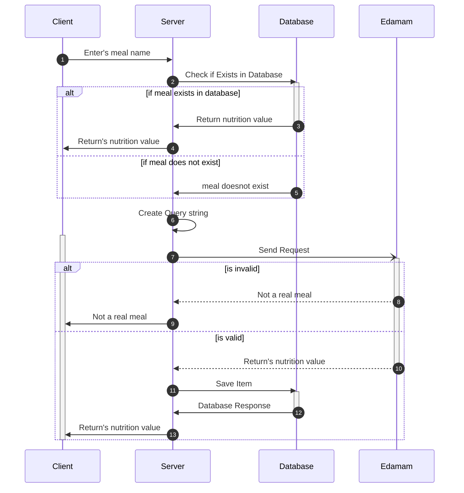

# API Calls to EDAMAM

```mermaid
sequenceDiagram
    autonumber
    participant Client
    participant Server
    participant Database 
    participant Edamam
    Client ->> Server: Enter's meal name
    Server ->> Database: Check if Exists in Database
    activate Database
    alt if meal exists in database
    Database ->> Server: Return nutrition value
    deactivate Database
    Server ->> Client: Return's nutrition value 
    else if meal does not exist
    Database ->> Server: meal doesnot exist
    end
    Server ->> Server: Create Query string
    activate Client
    Server -) Edamam: Send Request 
    activate Edamam
    alt is invalid
    Edamam -->> Server:  Not a real meal
    Server ->> Client:  Not a real meal
    else is valid
    Edamam -->> Server: Return's nutrition value
    deactivate Edamam
    Server ->> Database: Save Item 
    activate Database
    Database ->> Server: Database Response
    deactivate Database
    Server ->> Client: Return's nutrition value 
    end
    deactivate Client
```